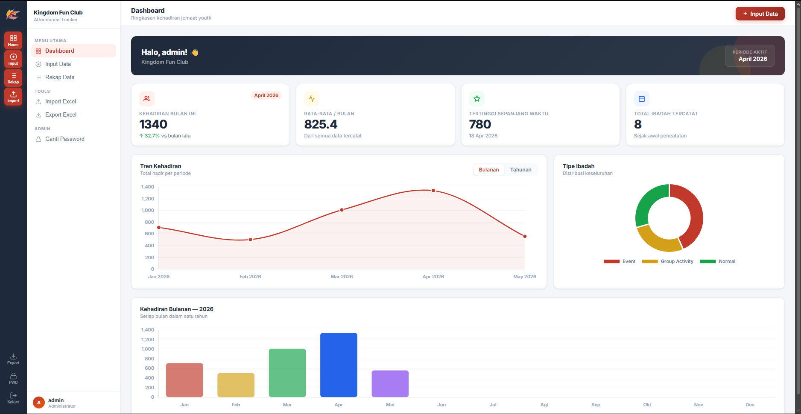
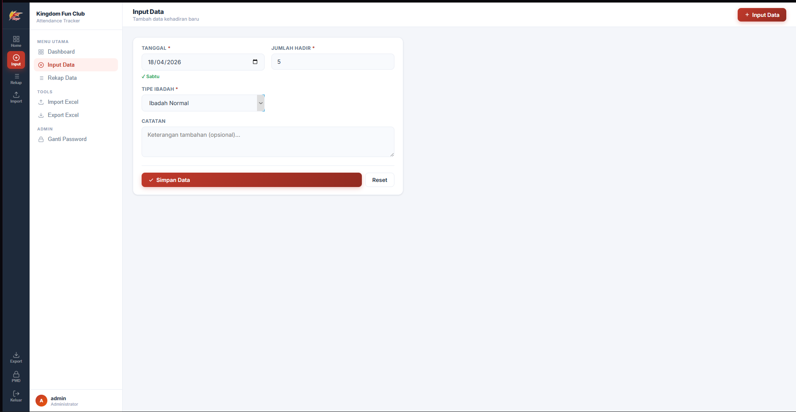
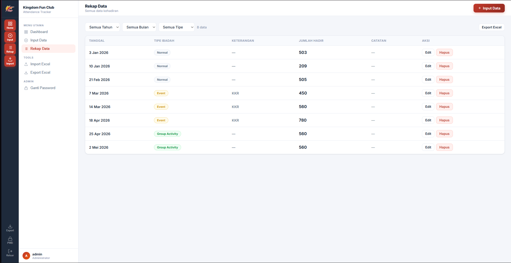
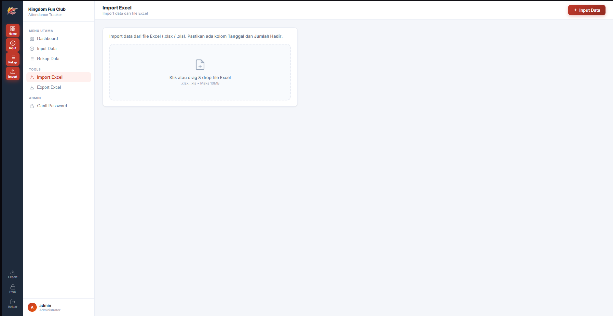

# Youth Community Attendance Tracker
> A web-based youth attendance tracker with data visualization, Excel import/export, and SQLite database.

# Preview

# Story behind attendance tracker
For years, Saturday night youth worship attendance data was recorded manually in spreadsheets, paper records, or not recorded at all. 
When questions about growth and accountability arose, there was no reliable data.
I took the initiative to change that. Instead of waiting for someone else to build it, I collaborated with AI to design and develop a web application that the team could use from day one.
This project taught me that identifying a real problem and taking ownership of the solution is far more important than waiting for the perfect moment or expertise.

# Main Features
- Dashboard & attendance data visualization
- Data input with automatic validation
- Excel import & export
- Admin and Member login system
- Data recap with filters

# Tech used
Python, Flask, SQLite, HTML/CSS/JavaScript

# How to run it
1. Install Python 3.10+
2. Clone this repository
3. `pip install -r requirements.txt`
4. `python app.py`
5. Open `http://localhost:5000`

# Notes
This project was built using Python Flask and SQLite with AI-assisted development. 
I defined the requirements, directed the architecture, handled testing and debugging, and iterated based on real user feedback.
This project stemmed from a problem I witnessed firsthand years of inconsistent attendance recording in my youth community, with no reliable data when accountability was needed. 
I took the initiative to change that.
Collaborating with AI taught me something important that the hardest part of building something isn't writing the code it's knowing what to build and why it matters.

Through this project, I learned how to break down real-world problems into technical requirements, make system architecture decisions, and deliver products that are actually used. 
It also changed the way I think about modern development,the tools you use are not limited to your clarity of thought and your commitment to solving the right problem.
